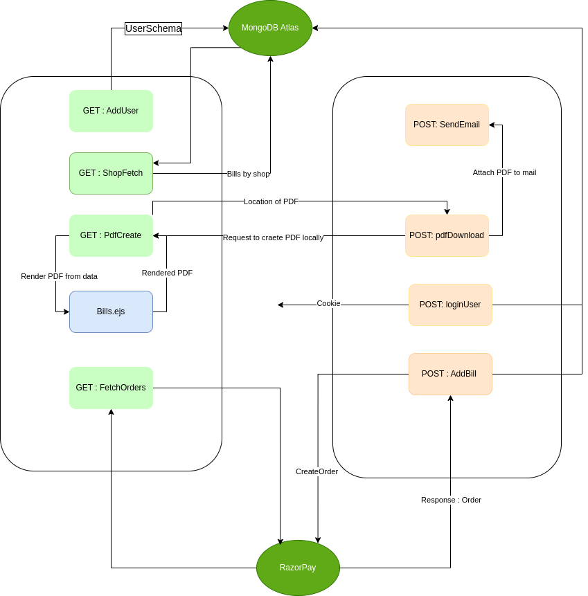
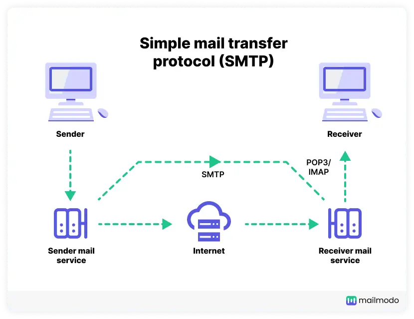

# Setting Up
- Add .env file
- run "npm i"
- run "nodemon index.js"

# Work FLOW

<center>



</center>

# Installed

|                       |                                                         |
| --------------------- | ------------------------------------------------------- |
| `mongoose`            | MongoDB ORM for Node.js data modeling.                  |
| `mongodb`             | NoSQL database for scalable, document-oriented storage. |
| `express`             | Minimalist Node.js web application framework.           |
| `bcryptjs`              | Password hashing library for secure authentication.     |
| `jsonwebtoken`        | Token-based authentication and authorization mechanism. |
| `multer`              | Middleware for handling file uploads in Node.js.        |
| `nodemon`             | Utility for automatic Node.js server restarts.          |
| `validator`           |                                                         |
| `mongoose-type-email` |                                                         |
| `dotenv`              |                                                         |
| `cookie-parser`              |Used for saving authentication token to the cookie                                                         |

# REQUESTS
- User SignUp
    - Request
    ```
    http://localhost:8000/addUser
    ```
    - Body
    ```
    {
    "shopName":"xyz",
    "firstName":"xyz",
    "shopEmail":"xyz@gmail.com",
    "lastName":"xyz",
    "password":"xyz"
    }
    ```

- User Login
    - Request
    ```
    http://localhost:8000/loginUser
    ```
    - Body
    ```
    {
    "loginEmail": "xyz@gmail.com",
    "password": "xyz"
    }
    ```
- Add bill
    - Request
    ```
    http://localhost:8000/addBill
    ```
    - Body
    ```
    {
    "consumerName" :"rishab",
    "consumerEmail" :"rkt10@iitbbs.ac.in",
    "shopEmail" :"an30@iitbbs.ac.in",
    "billAmount" :5000,
    "billDescription":"sadas"
    }
    ```
- Bill Fetch
    - Request
    ```
    http://localhost:8000/billFetch/:id
    ```
- Shop Fetch
    - Request
    ```
    http://localhost:8000/shopFetch?email=xyz.gmail.com
    ```

### WebHooks
- Say we want to subscribe some events on 3rd party server side say razorpay SDK
- So we cant be connected to the server 24x7 
- So instead we create a webhook 
- In Webhooks instead of our server fetching info about the events 3rd party server sends payload whenever event is triggered
- For that we provide our URL and events that we want to subscribe from 3rd party server  

## Changes
- BillFetch
- ShopFetch


## JWT v/s Session Storage

### Session Storage
- When client sends inital request it is authorised
- If request is valid the a session ID is stored in server 
- This session ID is sent back to client as cookie
- Now whenever client again sends requests
    - Server matches it with session key stored in its server

### JWT (JSON Web Token)
- For inital authorisation it is same as session storage
- When user is authorised it is encoded using a secret key and sent back to client and token is not stored in server
- When again client sends request with JWT, server uses secret key and check for JWT 
- If token matches then server sends appropriate response
- It consist of 3 parts 
    1. Header
    2. Payload
    3. Signature (Hashed with secret key)

### Session Storage v/s JWT
- Session ID needs to be stored in a server while JWT is not stored in server.
- When a client changes server so authorisation is again required as session ID is not present on this server
- On contrast JWT's secret key is present on all server so it can be easily used to compare token 
- Hence JWT is scalable

## Razorpay 
- We are using razorpay SDK for managing payments
- We initially create a razorpay instance
    ```js
    var razorpayInstance = new Razorpay({
    key_id: KEY_ID,
    key_secret: KEY_SECRET,
    });
    ```
- This instance will be used to intract with razorpay in future
- This instance is just a normal JSON object containing id,secret and other info

### Creating order 
- Razorpay's endpoint `Order` API uses POST request is used to create an order
```js
    var options = {
        amount: a.amount,
        currency: "INR",
        receipt: "rcp1",
        notes: {
            description: "notes desc",
            language: " lang",
            access: "access",
        },
    };

    razorpayInstance.orders.create(options, (err, order) => {
      if (err) {
        reject(err);
      } else {
        resolve(order);
      }
    });
```

### Order Payment 
- We are currently using rendering a page everytime payment button is clicked
- Over there we have a button to initalise payment 
- A when the button is pressed a razorpay instance is created
- After that a model is created using the checkout script provided by razorpay
- And the response is logged 

### Whenever we use billFetch 
- It fetches all bills from razorpay and mongoDB and compares then if the status is success or remaining and the same is displayed

## Mailing
- SMTP (Simple Mail Transfer Protocal)
- POP3 (Post Office Protocol)
- IMAP (Internet Message Access Protocol) 
- SMTP is used for sending mail 
- When we click on send mail so the mail is sent to over mail server using SMTP
- Then it is sent to the reciever's mail server using SMTP
- Then user's email fetches those mails using POP3 or IMAP
- In IMAP : we can access email using email server we cannot download to local machine 
- In POP3 : It downloads emails to local machines and then it is removed from the email server
- IMAP is most widely used
- 

## NodeMailer
- Gmail has OAuth2 : `Open Authorization` for protections against spammers
- So we cant directly send mail
- Hence gmail came up with allow plain userid and password for less secure apps
    - These apps need to be added to gmail
- Other way is using app specific password which is used in our case

## JWT
- Contains 3 parts seperated by `.` 
    1. Hashing algo
    2. Payload
    3. Hash with secret key
- Base 64 encoded
- When server recieve JWT it compares it with secret key
    - It uses First and second part and adds secret key to it and then hashes it 
    - If the hash matches with the 3rd part then payload is verified


## Scheduled Email sender
- node-cron is used to send periodic mail
- Upadtes in billschema
```js
    reminder:{
        type: Number,
        require: true,
        default: 7,
    },
    remdinderDate:{
        type: Date,
        require: true,
        default: Date.now() + 7 * 24 * 60 * 60 * 1000,
    }
```
- If expirey date exceeds then send bill each day
```js
cron.schedule("0 0 * * *", () => {
    schedular();
});
```
- Above function checks if the checks the bills whose reminder period is over and we need to send email to them
