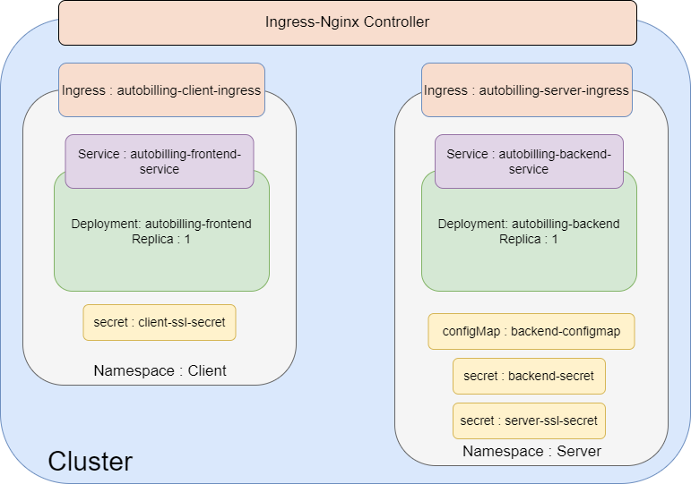

<center>

||||
|-|-|-|
|  |  |  |


# Autobilling APP

</center>

- This application enables shopkeepers to efficiently create and manage bills.
- Automated emails with Razorpay payment gateway integration will be sent on a scheduled basis for seamless payment processing.

# Setting Up NodeJs local env
- Node version : `v20.13.1`
- NPM version : `v20.13.1`
- Enviroment variables required
```sh
DATABASEURL = # generate your mongodb databaseURL 
SECRET_KEY = # used for JWT
KEY_ID = # razorpay key_id
KEY_SECRET = # razorpay key_id
FRONTEND_URL = # react app url for local testing use : http://localhost:4000
BACKEND_URL = # server url for local testing use : http://localhost:8000
```
- Install dependencies
    ```
    npm i
    ```
- Install nodemon for better testing 
    ```
    npm i nodemon
    ```
- Running server
    ```
    nodemon index.js
    ```
    - If you see `connected` message in log then app is running fine
### Web hook for reacording payment
- Setup a webhook reacording payment event on razorpay and provide API at route `/razorPaymentEvent`

# Setting up react app
- Install dependencies
    ```
    npm i
    ```
- Start react app
    ```
    PORT=4000 npm start
    ```


# Workflow
<center>

### List of all the API calls

</center>

# Containerizing application
- `Server` : From the root directory apply
    ```
    root/Autobilling$ docker build -t <image-name>:<tag> -f ./docker/Dockerfile .
    ```
    ```
    root/Autobilling$ docker build -t local-server -f ./docker/Dockerfile .
    ```
- `Client` : From the /client directory
    ```
    root/Autobilling/client$ docker build -t <image-name>:<tag> -f ./docker/Dockerfile .
    ```
    ```
    root/Autobilling/client$ docker build -t local-client -f ./docker/Dockerfile .
    ```
## Run app locally using docker image and docker compose
- Docker compose
    ```yaml
    version: '3.8'
    services:
      autobilling-server-container:
        image: local-server
        ports:
          - '8000:8000'
        environment:
          DATABASEURL: # DATABASEURL  
          SECRET_KEY: # SECRET_KEY  
          KEY_ID: # KEY_ID  
          KEY_SECRET: # KEY_SECRET 
          FRONTEND_URL: # FRONTEND_URL 
          BACKEND_URL: # BACKEND_URL 
      autobilling-client-container:
        image: local-client
        ports:
          - '4000:4000'
        environment:
          PORT: 4000
    ```

# Hosting a containerized application using Kubernetes on Google Cloud
- Secret files are not present in kubernetes folder
- Following is boiler plate code fill it with info
- Here I am assuming you have a domain and obtained a tls/ssl certificate
- Also reserve a static IP for both server and client
- The app wont work untill it is deployed on HTTPS as the CORS wont allow to attach cookies to the requests
```yaml
apiVersion: v1
kind: Secret
metadata:
  name: backend-secret
  namespace: server 
type: Opaque
data:
  databaseurl: # 64 byte encoded  
  secret-key: # 64 byte encoded 
  key-id: # 64 byte encoded 
  key-secret: # 64 byte encoded 
```


```yaml

apiVersion: v1
kind: Secret
metadata:
  name: server-ssl-secret
  namespace: server 
type: kubernetes.io/tls
data:
  tls.crt: # 64 byte encoded
  tls.key: # 64 byte encoded

---

apiVersion: v1
kind: Secret
metadata:
  name: client-ssl-secret
  namespace: client  
type: kubernetes.io/tls
data:
  tls.crt: # 64 byte encoded
  tls.key: # 64 byte encoded

```

<center>

</center>

- To test APIs use the test.rest file after installing REST client extenstion on vs code 
```yaml
### Login
POST http://localhost:8000/loginUser
Content-Type: application/json

{
  "email": "ohmvaghela1@gmail.com",
  "password": "ohm123ohm"
}

```

```yaml
### Signup
POST http://localhost:8000/addUser
Content-Type: application/json

{
  "shopName": "req.body.name",
  "firstName": "req.body.firstname",
  "lastName": "req.body.lastname",
  "shopEmail": "req.body.email",
  "password": "password"
}

```

```yaml
### Add Bill
POST http://localhost:8000/addbill
Content-Type: application/json
auth-token: {{auth-token}}

{
  "consumerName": "req.body.consumerName",
  "consumerEmail": "req.body.consumerEmail",
  "shopEmail": "req.body.shopEmail",
  "billAmount": "req.body.billAmount",
  "billDescription": "req.body.billDescription"
}

```

```yaml
### Fetch Bill by Email
POST http://localhost:8000/fetchOrderByEmail
Content-Type: application/json
auth-token: {{auth-token}}

{
  "shopEmail": "req.body.shopEmail"
}

```