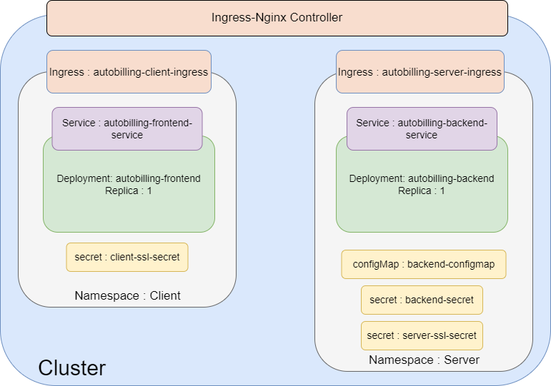

<center>

||||
|-|-|-|
|  |  |  |


# Autobilling APP

</center>

- This application enables shopkeepers to efficiently create and manage bills.
- Automated emails with Razorpay payment gateway integration will be sent on a scheduled basis for seamless payment processing.

# Content

- [Setting Up NodeJs local env](./readme.md#setting-up-nodejs-local-env)
- [Setting up react app](./readme.md#setting-up-react-app)
- [Workflow](./readme.md#workflow)
- [Containerizing application](./readme.md#containerizing-application)
- [Hosting a containerized application using Kubernetes on Google Cloud](./readme.md#hosting-a-containerized-application-using-kubernetes-on-google-cloud)
- [WebHooks](./readme.md#webhooks)
- [Email Service](./readme.md#email-service)
- [MongoDB](./readme.md#mongodb)
- [Razorpay integration](./readme.md#razorpay-integration)

# Setting Up NodeJs local env
- Node version : `v20.13.1`
- NPM version : `v20.13.1`
- Enviroment variables required
```sh
DATABASEURL = # generate your mongodb databaseURL 
SECRET_KEY = # used for JWT
KEY_ID = # razorpay key_id
KEY_SECRET = # razorpay key_id
FRONTEND_URL = # react app url for local testing use : http://localhost:4000
BACKEND_URL = # server url for local testing use : http://localhost:8000
```
- Install dependencies
    ```
    npm i
    ```
- Install nodemon for better testing 
    ```
    npm i nodemon
    ```
- Running server
    ```
    nodemon index.js
    ```
    - If you see `connected` message in log then app is running fine
### Web hook for reacording payment
- Setup a webhook reacording payment event on razorpay and provide API at route `/razorPaymentEvent`

# Setting up react app
- Install dependencies
    ```
    npm i
    ```
- Start react app
    ```
    PORT=4000 npm start
    ```


# Workflow
<center>

### List of all the API calls

</center>

# Containerizing application
- `Server` : From the root directory apply
    ```
    root/Autobilling$ docker build -t <image-name>:<tag> -f ./docker/Dockerfile .
    ```
    ```
    root/Autobilling$ docker build -t local-server -f ./docker/Dockerfile .
    ```
- `Client` : From the /client directory
    ```
    root/Autobilling/client$ docker build -t <image-name>:<tag> -f ./docker/Dockerfile .
    ```
    ```
    root/Autobilling/client$ docker build -t local-client -f ./docker/Dockerfile .
    ```
## Run app locally using docker image and docker compose
- Docker compose
    ```yaml
    version: '3.8'
    services:
      autobilling-server-container:
        image: local-server
        ports:
          - '8000:8000'
        environment:
          DATABASEURL: # DATABASEURL  
          SECRET_KEY: # SECRET_KEY  
          KEY_ID: # KEY_ID  
          KEY_SECRET: # KEY_SECRET 
          FRONTEND_URL: # FRONTEND_URL 
          BACKEND_URL: # BACKEND_URL 
      autobilling-client-container:
        image: local-client
        ports:
          - '4000:4000'
        environment:
          PORT: 4000
    ```

# Hosting a containerized application using Kubernetes on Google Cloud

## Problems Deploying MERN stack app on kubernetes
- When we have deployed a react(javascript based frontend) app on kubernetes
  - The service run on pod but the javascript code runs on browser
  - So it runs outside the pod hence it does not have access to kuberenetes resources
- To solve this there are two ways
  - Setup loadBalancer service and put external endpoint to backend config
  - Setup ingress controller and deploy both Ingress controller and Service with backend   


- Secret files are not present in kubernetes folder
- Following is boiler plate code fill it with info
- Here I am assuming you have a domain and obtained a tls/ssl certificate
- Also reserve a static IP for both server and client
- The app wont work untill it is deployed on HTTPS as the CORS wont allow to attach cookies to the requests
```yaml
apiVersion: v1
kind: Secret
metadata:
  name: backend-secret
  namespace: server 
type: Opaque
data:
  databaseurl: # 64 byte encoded  
  secret-key: # 64 byte encoded 
  key-id: # 64 byte encoded 
  key-secret: # 64 byte encoded 
```


```yaml

apiVersion: v1
kind: Secret
metadata:
  name: server-ssl-secret
  namespace: server 
type: kubernetes.io/tls
data:
  tls.crt: # 64 byte encoded
  tls.key: # 64 byte encoded

---

apiVersion: v1
kind: Secret
metadata:
  name: client-ssl-secret
  namespace: client  
type: kubernetes.io/tls
data:
  tls.crt: # 64 byte encoded
  tls.key: # 64 byte encoded

```

<center>

</center>

- To test APIs use the test.rest file after installing REST client extenstion on vs code 
```yaml
### Login
POST http://localhost:8000/loginUser
Content-Type: application/json

{
  "email": "ohmvaghela1@gmail.com",
  "password": "ohm123ohm"
}

```

```yaml
### Signup
POST http://localhost:8000/addUser
Content-Type: application/json

{
  "shopName": "req.body.name",
  "firstName": "req.body.firstname",
  "lastName": "req.body.lastname",
  "shopEmail": "req.body.email",
  "password": "password"
}

```

```yaml
### Add Bill
POST http://localhost:8000/addbill
Content-Type: application/json
auth-token: {{auth-token}}

{
  "consumerName": "req.body.consumerName",
  "consumerEmail": "req.body.consumerEmail",
  "shopEmail": "req.body.shopEmail",
  "billAmount": "req.body.billAmount",
  "billDescription": "req.body.billDescription"
}

```

```yaml
### Fetch Bill by Email
POST http://localhost:8000/fetchOrderByEmail
Content-Type: application/json
auth-token: {{auth-token}}

{
  "shopEmail": "req.body.shopEmail"
}

```

# WebHooks
- Instead of asking 3rd party services repeatedly about the status
- Third party services call a route to update once the status is updated
- Like in the app instead of asking about payment status repeatedly 
  - Razorpay can send request once the status is changed or any action/event has taken place
- Here in the code we use `secret` + `request's body` to generate a `HMAC` code 
  - Then we compare this code with request header to check the authenticitiy of the request 
- Both `HMAC(Hash-based Message Authentication Code)` and JWT have many things in common 
  - Both HMACs and JWTs use a secret key to generate a cryptographic signature.
  - This signature is used to verify the integrity and authenticity of the message.

```js
const logRazorPayment = async (req, res) => {
    const secret = KEY_SECRET;

    // Create an HMAC (Hash-based Message Authentication Code) object.
    // HMAC is used to generate a digital signature based on the request body and the secret key.
    // 'sha256' specifies the hashing algorithm.
    const shasum = crypto.createHmac('sha256', secret);

    // Update the HMAC object with the JSON stringified request body.
    // This calculates the HMAC based on the content of the webhook request.
    shasum.update(JSON.stringify(req.body));

    // Calculate the final HMAC digest (the signature) and convert it to a hexadecimal string.
    // This is the signature calculated on your server.
    const digest = shasum.digest('hex');

    // Compare the calculated digest with the 'x-razorpay-signature' header from the request.
    // This header contains the signature generated by Razorpay.
    if (digest === req.headers['x-razorpay-signature']) {
        // If the signatures match, the webhook is verified.
        console.log('Webhook verified');

        // Extract the order ID from the request body.
        // This order ID is used to find the corresponding bill in your database.
        const orderId = req.body.payload.payment.entity.order_id;

        // Find the bill in the database using the order ID.
        const bill = await findBillByOrderId(orderId);

        // Check if the bill was found.
        if (bill) {
            // If the bill is found, update its status to 'true' (paid).
            bill.billStatus = true;

            // Save the updated bill to the database.
            await bill.save();

            // Log the updated bill status.
            console.log('Bill status updated to true:', bill);

            // Send a 200 (OK) response to Razorpay, acknowledging receipt of the webhook.
            res.status(200).send('Webhook received');
        } else {
            // If the bill is not found, log an error.
            console.log('Bill not found:', bill);

            // Send a 400 (Bad Request) response to Razorpay, indicating that the bill was not found.
            res.status(400).send('Bill not found');
        }
    } else {
        // If the signatures do not match, the webhook verification failed.
        console.log('Webhook verification failed');

        // Send a 400 (Bad Request) response to Razorpay, indicating an invalid signature.
        res.status(400).send('Invalid signature');
    }
};
```

# Email Service
- NodeMailer is used as emailing service
- There are two ways to integrate email service
  - App Password : Used in app 
  - OAuth2
- It has `transporter` object which is responsible for delivering mail
  - As it acts as connection between SMTP and other email services
- Transporter object is created using `nodemailer.createTranspot({options})`
  
  ```js
  const nodemailer = require('nodemailer');

  const transporter = nodemailer.createTransport({
    service: 'gmail', // Or 'smtp' if using custom server
    auth: {
      user: 'your-email@gmail.com',
      pass: 'your-app-password',
    },
    // If using a custom server:
    // host: 'smtp.example.com',
    // port: 587,
    // secure: true, // or false
    // tls: {
    //   rejectUnauthorized: false,
    // },
  });
  ```

- Then we need to set mailing options like reciever, subject, payload etc.  

  ```js
  const mailOptions = {
    from: "autobilling4@gmail.com",
    to: req.body.consumerEmail,
    subject: "Payment Due",
    text: `Please pay the bill using the following link: ${BACKEND_URL}/pdfCreate/${req.body._id}`,
  };
  ```

- Then to send it we use sendMail method of Transporter object

  ```js
  await transporter.sendMail(mailOptions);
  ```

# MongoDB 
- Replica Set architecture was used in the app
- For the same mongoDB atlas was used 
  - As it provide Cloud Based Database Service
- Atlas's free tier was used with gives 3 replica set
- Region AP-south-1(AWS/Mumbai)
- No backup


# Razorpay integration
- When a request for bill creation is recieved
  - First we send a request to create a bill on razorpay using razorpay SDK
  - And with the response from razorpay there is orderID attached which is used to store bill in mongodb
  - So first call to razorpay then call to mongodb
- For payment Razorpay's SDK was used
  - It provided a `checkout.js` library which renders a `modal`
  - So Users will recieve a mail conataining a link, which will render a bill on new tab
  - This page is generated using EJS templates, allowing for real time data from the database.
  - That rendered bill will have embaded js script, with a `button` to pay
    - When clicked on button it runs renders razorpay's `modal`
    - And then razorpay takes over for the payment part
    - Once the payment is done, a webhook calls a route and registers payment

#